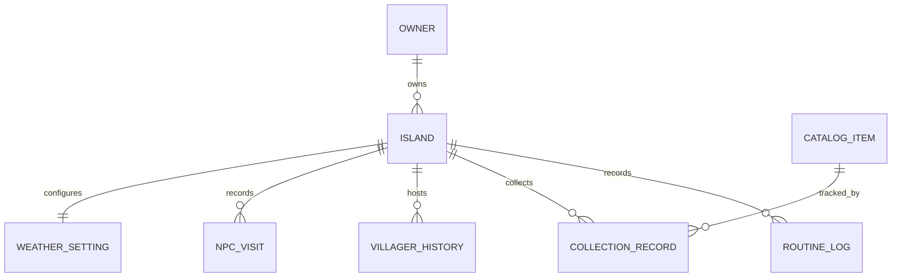
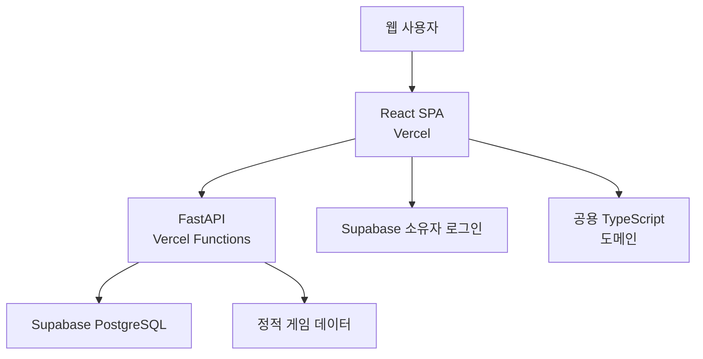
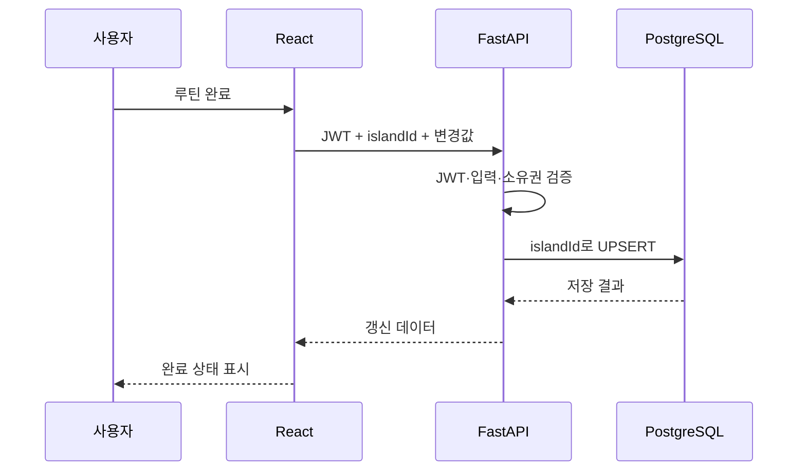
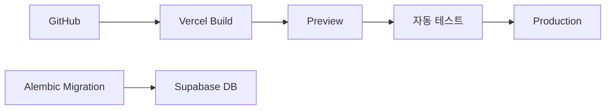
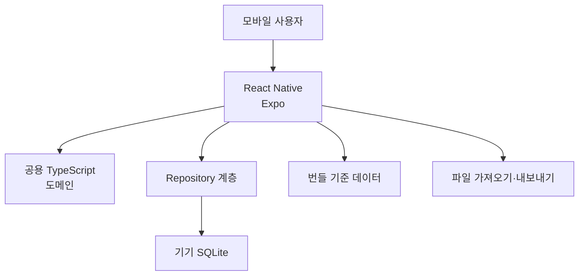
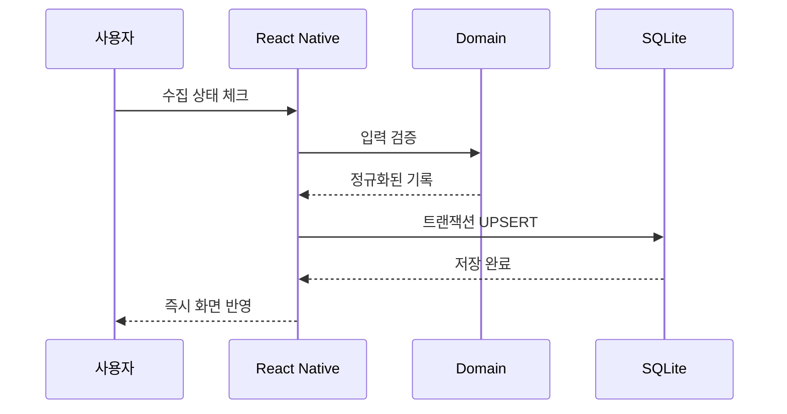

2. 아키텍처 설계(SAD, Software Architecture Design)

> **문서 상태:** Draft v0.1 · 작성일 2026-08-24 · 기준 SRS v0.2
> 

<aside>
🏗️

**권장 결론**

웹 MVP는 **React + Vite / FastAPI / Supabase PostgreSQL / Vercel** 조합으로 진행한다. 모바일앱은 **React Native + Expo / SQLite / 로컬 우선 구조**로 구축한다. 웹과 모바일에서 함께 사용할 계산·검증 로직은 Python API에 종속시키지 않고 공용 TypeScript 도메인 패키지로 분리한다.

</aside>

**관련 문서:** 1. 요구사항 정의 및 분석(SRS, Software Requirements Specification)

# 1. 문서 개요

## 1.1 목적

본 문서는 모동숲 다이어리 SRS v0.2를 구현하기 위한 소프트웨어 아키텍처를 정의한다. 웹앱과 모바일앱을 별도 배포물로 설계하되 도메인 모델, 계산 규칙, 화면 개념을 재사용할 수 있도록 한다.

## 1.2 설계 범위

- 웹앱: React 프론트엔드, FastAPI 백엔드, Supabase PostgreSQL, Vercel 배포
- 모바일앱: React Native와 Expo, SQLite 기반 로컬 저장
- MVP 공통: 섬별 기록 격리, 도감 기준 데이터, 날짜 기반 계산. 무 값 계산은 Post-MVP에서 추가한다.
- MVP 비대상: 날씨, 공략, 무 값 계산기, 아이템 변형별 수집, 일반 사용자 회원가입, 웹·모바일 자동 동기화, NPC 자동 판별
- 날씨는 MVP 이후 추가할 확장 기능으로 분리한다.

## 1.3 품질 목표

| 우선순위 | 품질 속성 | 설계 방향 |
| --- | --- | --- |
| 1 | 데이터 격리 | 모든 개인 기록에 island_id를 적용하고 활성 섬 기준으로 조회한다. |
| 2 | 모바일 오프라인 | 모바일 핵심 기능은 네트워크와 FastAPI 없이 동작한다. |
| 3 | 재사용성 | 웹과 모바일이 타입, 검증 규칙, 계산 로직을 공유한다. |
| 4 | 단순한 운영 | MVP에서는 관리형 서비스와 서버리스 배포를 사용한다. |
| 5 | 확장 가능성 | 날씨 엔진, 저장소, 기준 데이터 공급자를 인터페이스 뒤에 둔다. |

# 2. 핵심 아키텍처 결정

## ADR-001 · 모노레포와 공용 TypeScript 패키지

**결정:** 웹, 모바일, 공용 로직을 하나의 모노레포에서 관리한다.

```
apps/
  web/                 React + Vite
  api/                 FastAPI
  mobile/              React Native + Expo
packages/
  domain/              공용 타입, 검증, 계산 규칙
  ui-tokens/           색상, 간격, 타이포그래피 토큰
  game-data/           생성된 기준 데이터와 스키마
  api-client/          웹 FastAPI 클라이언트
services/
  weather-engine/      날씨 엔진 어댑터
```

- packages/domain에는 MVP에서 섬, 루틴, 수집 상태, 주민 이력, 날짜 판정, 생물 출현 판정을 둔다. 무 값 계산 인터페이스는 Post-MVP 착수 시 추가한다.
- React 전용 UI 컴포넌트를 React Native에서 그대로 공유하려 하지 않는다.
- 디자인 토큰과 도메인 로직을 우선 공유한다.
- FastAPI는 영속화, 서버 검증, 관리용 데이터 제공에 집중한다.
- 모바일에서 필요한 계산을 Python에만 구현하지 않는다.

## ADR-002 · 웹은 PostgreSQL, 모바일은 SQLite

- 웹: Supabase PostgreSQL
- 모바일: Expo SQLite
- 자동 동기화: 제공하지 않음
- 향후 수동 이동: 버전이 포함된 JSON 또는 SQLite 백업 파일로 확장 가능
- 두 저장소는 동일한 논리 테이블과 안정 ID를 사용한다.

## ADR-003 · 1인 전용 웹 데이터 접근

- 웹앱은 소유자 1인만 사용하는 단일 사용자 애플리케이션으로 운영한다.
- 사용자 기록은 Supabase PostgreSQL에 영속 저장하며 Supabase Anonymous Auth는 사용하지 않는다.
- React에서 DB 비밀번호나 Service Role Key를 사용하지 않고 모든 변경은 FastAPI를 통한다.
- DB 모델은 별도 owner_id 없이 island_id를 개인 기록의 최상위 구분자로 사용한다.
- 웹 접근은 Supabase Auth에 사전 생성한 소유자 계정 1개의 이메일·비밀번호 로그인으로 제한한다. 공개 회원가입은 비활성화한다.

<aside>
🔒

DB에 저장된 데이터는 브라우저 로그인 세션과 무관하게 유지된다. 세션이 만료되면 다시 로그인하며, 기존 데이터는 그대로 유지된다.

</aside>

## ADR-004 · 계산 엔진과 저장 계층 분리

다음 기능은 순수 함수 또는 교체 가능한 엔진으로 구현한다.

- 날짜·반구·시간 기반 생물 출현 판정
- 시즌·이벤트 판정
- 루틴 반복 및 날짜 초기화
- 무 가격 패턴 계산
- 날씨 시드 기반 예보
- MeteoNook 관측 JSON 파싱과 검증

```tsx
interface WeatherEngine {
  forecast(input: {
    seed: number;
    hemisphere: "north" | "south";
    date: string;
  }): WeatherForecast;
}

interface CollectionRepository {
  list(islandId: string, category?: string): Promise<CollectionRecord[]>;
  upsert(record: CollectionRecord): Promise<void>;
}
```

웹은 HTTP Repository 구현을, 모바일은 SQLite Repository 구현을 주입한다.

## ADR-005 · 외부 오픈소스 로직 격리

- MeteoNook 코드 재사용 전 AGPL-3.0 의무를 검토한다.
- Turnip Prophet 코드 재사용 시 Apache-2.0 저작권·라이선스 고지를 포함한다.
- 외부 로직은 WeatherEngine, TurnipPredictor 어댑터 뒤에 둔다.
- 게임 업데이트로 정확도가 바뀔 수 있으므로 결과에 engine_version을 기록한다.

# 3. 공통 도메인 설계

## 3.1 도메인 모듈

| 모듈 | 책임 | 주요 엔터티 |
| --- | --- | --- |
| Island | 섬 생성·전환·수정·삭제, 주민대표, 반구와 날씨 시드 | Island, Representative |
| Today | 선택 날짜의 정보 조합 및 홈 ViewModel 생성 | TodaySummary |
| Routine | 기본·사용자 루틴과 날짜별 완료 기록 | RoutineDefinition, RoutineLog |
| Encyclopedia | 기준 데이터 검색·필터 및 섬별 수집 상태 | CatalogItem, CollectionRecord |
| Villager | 주민 검색, 현재·위시·캠핑·과거 이력과 액자 | Villager, IslandVillagerHistory |
| NPC | 날짜별 수동 방문 기록 | NpcVisit |
| Weather | 시드 기반 예보, 관측 JSON 파싱, 정확도 고지 | WeatherSetting, Forecast, Observation |
| Guide | 공략 콘텐츠와 무 가격 예측 | TurnipWeek, TurnipPrice, Prediction |

## 3.2 식별자와 날짜 규칙

- 모든 엔터티는 UUID를 기본 식별자로 사용한다.
- 사용자 기록 테이블은 반드시 island_id를 가진다.
- 현재 웹은 단일 사용자 구조이므로 owner_id를 사용하지 않는다. 다중 사용자 지원 시 migration으로 추가한다.
- 날짜별 기록은 ISO 8601 YYYY-MM-DD 형식의 게임 날짜를 사용한다.
- 하루 경계가 자정인지 게임 기준 오전 5시인지 도메인 정책으로 분리한다.
- 서버 저장 시각은 UTC로 저장하고 화면에서 로컬 시간대로 변환한다.
- 생일은 연도가 없는 월·일로 관리한다.
- 기준 데이터 ID는 웹과 모바일에서 동일한 안정 ID를 사용한다.

## 3.3 논리 데이터 모델



| 테이블 | 핵심 컬럼 | 제약·인덱스 |
| --- | --- | --- |
| islands | id, name, hemisphere, native_fruit, native_flower, is_active | 활성 섬 1개, 섬 이름 최대 10자 |
| representatives | id, island_id, name, birthday_month, birthday_day | island_id FK |
| routine_definitions | id, island_id, name, target_count, repeat_rule, sort_order, is_active | island_id + sort_order |
| routine_logs | id, island_id, routine_id, game_date, current_count, completed | UNIQUE island_id + routine_id + game_date |
| catalog_items | id, category, subtype, name_ko, metadata_json, data_version | category·name 검색 인덱스 |
| collection_records | id, island_id, item_id, owned, caught, donated, first_recorded_date | UNIQUE island_id + item_id |
| villagers | id, name_ko, species, personality, subtype, birthday | 이름·종·성격 인덱스 |
| island_villager_history | id, island_id, villager_id, status, moved_in, moved_out, visited_at, photo_owned | island_id + status |
| npc_visits | id, island_id, npc_id, visit_date, memo | UNIQUE island_id + npc_id + visit_date |
| turnip_weeks | id, island_id, week_start, buy_price, previous_pattern, first_buy | UNIQUE island_id + week_start |
| turnip_prices | id, turnip_week_id, weekday, period, price | UNIQUE turnip_week_id + weekday + period |

# 4. 웹앱 아키텍처

## 4.1 기술 스택

| 계층 | 선택 기술 | 역할 |
| --- | --- | --- |
| 프론트엔드 | React + TypeScript + Vite | SPA, 반응형 UI |
| 라우팅 | React Router | MVP 오늘·주민·도감 및 상세 경로. 공략 경로는 Post-MVP |
| 서버 상태 | TanStack Query | API 캐시, 재시도, 낙관적 업데이트 |
| 클라이언트 상태 | Zustand 또는 React Context | 활성 섬, UI 상태, 필터 |
| API | FastAPI + Pydantic | CRUD, 검증, Supabase JWT 및 관리자 ID 확인, OpenAPI |
| ORM·마이그레이션 | SQLAlchemy 2 + Alembic | PostgreSQL 접근과 스키마 버전 관리 |
| DB | Supabase PostgreSQL | 웹 개인 기록과 기준 데이터 |
| 접근 제어 | Supabase Auth 단일 소유자 인증 | 회원가입이 차단된 소유자 계정 1개와 FastAPI JWT 검증 |
| 배포 | Vercel | React 정적 배포와 FastAPI Functions |
| 테스트 | Vitest, React Testing Library, Pytest | 도메인·UI·API 테스트 |

## 4.2 컨테이너 뷰



## 4.3 책임 분리

### React

- 화면 렌더링과 사용자 입력
- 활성 섬과 선택 날짜 상태 관리
- 공용 도메인 계산 호출
- FastAPI 호출 및 오류·로딩·빈 상태 처리
- Supabase 소유자 로그인 세션 생성·갱신

### FastAPI

- 1인 전용 배포 접근 제한 확인
- 요청 islandId와 리소스 관계 검증
- MVP: 섬·루틴·수집·주민 이력·NPC 기록 CRUD. 무 값 기록 CRUD는 Post-MVP
- 날씨 관련 API와 JSON 검증은 후속 버전에서 추가
- 기준 데이터 검색 API
- 구조화 로그와 통일된 오류 응답

### Supabase

- PostgreSQL 영속 저장
- 소유자 계정의 사용자 ID와 JWT 발급
- RLS는 직접 Data API를 노출할 경우 필수 적용
- 서버리스 FastAPI 연결에는 Supavisor Transaction Pooler 사용

## 4.4 요청 흐름



## 4.5 API 설계 원칙

- 기본 경로는 /api/v1
- 리소스 중심 REST API
- 모든 섬 하위 리소스는 서버에서 소유권 재검증
- 삭제는 영향 범위와 명시적 확인값 요구
- 목록은 페이지네이션, 검색, 필터 지원
- 오류 형식은 code, message, field_errors, trace_id로 통일
- UPSERT와 idempotency를 고려

### 주요 엔드포인트 초안

```
POST   /api/v1/islands
GET    /api/v1/islands
PATCH  /api/v1/islands/{island_id}
DELETE /api/v1/islands/{island_id}
POST   /api/v1/islands/{island_id}/activate

GET    /api/v1/islands/{island_id}/today?date=YYYY-MM-DD
GET    /api/v1/islands/{island_id}/routines?date=YYYY-MM-DD
PUT    /api/v1/islands/{island_id}/routine-logs/{routine_id}/{date}

GET    /api/v1/catalog/items
GET    /api/v1/islands/{island_id}/collections
PUT    /api/v1/islands/{island_id}/collections/{item_id}

GET    /api/v1/villagers
GET    /api/v1/islands/{island_id}/villagers
POST   /api/v1/islands/{island_id}/npc-visits

PUT    /api/v1/islands/{island_id}/weather-setting
POST   /api/v1/weather/observations/import
GET    /api/v1/islands/{island_id}/weather?date=YYYY-MM-DD

GET    /api/v1/islands/{island_id}/turnips/{week_start}
PUT    /api/v1/islands/{island_id}/turnips/{week_start}
```

## 4.6 Supabase·Vercel 적합성 평가

### 그대로 사용해도 되는 이유

- Supabase는 PostgreSQL과 Auth를 제공한다. Auth에는 소유자 계정 1개만 사전 생성하고 공개 회원가입을 비활성화한다.
- Vercel은 React 정적 배포와 FastAPI ASGI 애플리케이션 배포를 지원한다.
- 트래픽이 크지 않은 개인 프로젝트 MVP에 운영 부담이 낮다.
- 프론트와 API의 Preview Deployment를 함께 검증하기 쉽다.

### 반드시 보완할 부분

- FastAPI에서 Supabase DB로 연결할 때 서버리스용 Transaction Pooler 포트 6543을 사용한다.
- SQLAlchemy 연결 풀은 작게 설정하고 장기 연결을 가정하지 않는다.
- 대용량 배치, 장시간 크롤링, 상주 워커를 Vercel Function에 넣지 않는다.
- DB 마이그레이션은 CI 또는 별도 관리 명령으로 수행한다.
- DB 비밀번호와 Service Role Key를 브라우저에 포함하지 않는다.

### FastAPI 호스팅을 바꿀 시점

다음 요구가 생기면 FastAPI만 Railway, Render, Fly.io 등의 장기 실행 컨테이너로 이전하고 React는 Vercel에 유지한다.

- 백그라운드 작업과 작업 큐
- 장시간 데이터 수집·변환
- WebSocket 또는 지속 연결
- 서버 메모리 캐시 의존
- 서버리스 실행 시간이나 콜드 스타트가 실제 문제로 확인될 때

현재 SRS 범위에서는 Vercel FastAPI로 시작해도 된다.

## 4.7 웹 데이터 보안

- 클라이언트에는 DB 비밀번호와 Supabase Service Role Key를 포함하지 않는다.
- FastAPI는 Supabase JWT의 서명·만료·issuer·audience를 검증하고, JWT의 `sub`가 환경변수로 설정한 `ADMIN_USER_ID`와 일치하는 요청만 처리한다.
- Repository 메서드는 island_id를 필수 인자로 받는다.
- 현재 단일 사용자 구조에서는 owner_id를 DB에 저장하지 않지만, API 접근 제어를 위해 Supabase JWT와 고정 `ADMIN_USER_ID`를 사용한다.
- 입력 JSON 크기 제한과 요청 속도 제한을 적용한다.
- CORS는 실제 Vercel 도메인과 로컬 개발 도메인만 허용한다.
- 삭제 작업은 트랜잭션과 명시적 확인을 사용한다.

## 4.8 웹 배포



- PR마다 Preview Deployment
- main 병합 시 프로덕션 배포
- DB migration은 앱 시작 시 자동 실행하지 않는다.
- 개발·프로덕션 Supabase 프로젝트를 분리한다.

# 5. 모바일앱 아키텍처

## 5.1 기술 스택

| 계층 | 선택 기술 | 역할 |
| --- | --- | --- |
| 앱 | React Native + TypeScript + Expo | iOS·Android 공통 앱 |
| 라우팅 | Expo Router | 파일 기반 화면 이동 |
| 로컬 DB | expo-sqlite | 개인 기록 영속화 |
| 상태 관리 | Zustand + Repository hooks | 활성 섬·필터·UI 상태 |
| 공용 로직 | packages/domain | 웹과 같은 계산·검증 규칙 |
| 빌드·배포 | EAS Build·Submit | 스토어 바이너리 생성·배포 |
| 테스트 | Jest, React Native Testing Library, Maestro 또는 Detox | 도메인·화면·E2E 테스트 |

## 5.2 컨테이너 뷰



FastAPI와 Supabase는 모바일 핵심 기능의 실행 경로에 포함하지 않는다.

## 5.3 로컬 우선 흐름



## 5.4 SQLite 설계

- 웹 PostgreSQL과 동일한 논리 테이블명과 컬럼명을 유지한다.
- 웹과 모바일 모두 현재 owner_id를 사용하지 않는다.
- island_id는 모든 개인 기록에 필수다.
- PRAGMA foreign_keys = ON을 적용한다.
- 스키마 버전 테이블과 순차 migration을 운영한다.
- 기준 데이터는 앱에 포함된 SQLite DB 또는 압축 JSON에서 초기 적재한다.
- 검색이 많은 이름·카테고리·상태 필드에 인덱스를 둔다.
- 앱 삭제 시 로컬 데이터도 삭제됨을 안내한다.

## 5.5 기준 게임 데이터 배포

1. 원본 데이터를 별도 스크립트에서 수집·정제한다.
2. 공통 스키마로 검증한다.
3. 버전이 지정된 JSON과 SQLite seed를 생성한다.
4. 웹은 PostgreSQL 또는 정적 JSON에서 읽는다.
5. 모바일은 앱 번들에 SQLite seed를 포함한다.
6. 데이터 출처와 라이선스 정보를 함께 배포한다.

```
game-data/
  schema/
  source/
  normalized/
  generated/
    catalog.v1.json
    catalog.v1.sqlite
    manifest.json
```

manifest에는 데이터 버전, 생성일, 지원 게임 버전, 체크섬, 출처를 기록한다.

## 5.6 백업·복원 확장점

- 앱 전체 백업에는 format, version, exportedAt을 포함한다.
- 가져오기 전에 형식·버전·크기·필수 ID를 검증한다.
- 기존 데이터와 교체 또는 병합을 사용자가 선택한다.
- 복원 전 로컬 백업을 생성한다.
- MeteoNook 관측 JSON과 앱 전체 백업 JSON을 다른 형식으로 구분한다.

# 6. 웹과 모바일 공유 범위

| 항목 | 공유 여부 | 방법 |
| --- | --- | --- |
| 도메인 타입 | 공유 | TypeScript package |
| 날짜·출현·무 값 계산 | 공유 | 순수 함수 또는 엔진 인터페이스 |
| 데이터 검증 | 부분 공유 | Zod와 Pydantic 계약 테스트 |
| 디자인 토큰 | 공유 | 색상·간격·타이포그래피 JSON |
| 화면 컴포넌트 | 제한적 | 웹과 네이티브 차이 허용 |
| Repository 인터페이스 | 공유 | 웹 HTTP·모바일 SQLite 구현 분리 |
| 실제 사용자 데이터 | 공유 안 함 | 웹 DB와 기기 SQLite에 각각 저장 |
| FastAPI | 웹만 사용 | 모바일 오프라인 경로에서 제외 |

# 7. 레이어 구조

## 7.1 프론트엔드

```
presentation/
  pages/
  components/
  navigation/
application/
  use-cases/
  view-models/
domain/
  entities/
  rules/
  engines/
infrastructure/
  api/
  repositories/
  storage/
```

의존성은 presentation → application → domain 방향으로 흐른다. 저장소와 HTTP 구현은 infrastructure가 담당하고 domain은 React, FastAPI, Supabase, SQLite를 알지 못한다.

## 7.2 FastAPI

```
app/
  api/v1/
  schemas/
  application/use_cases/
  domain/models/
  infrastructure/db/
  infrastructure/repositories/
  infrastructure/auth/
  core/
```

- Router에서 SQL을 직접 실행하지 않는다.
- Use Case가 권한 검증과 트랜잭션 경계를 조정한다.
- Repository가 SQLAlchemy 쿼리를 캡슐화한다.
- Pydantic API 모델과 SQLAlchemy 모델을 분리한다.

# 8. 요구사항 추적

| SRS 요구사항 | 아키텍처 요소 | 주요 검증 |
| --- | --- | --- |
| FR-ISL-001~008 | Island 모듈, islands·representatives, WeatherSetting | 섬 전환·소유권·시드 검증 |
| FR-TDY-001~016 | Today Use Case, WeatherEngine, 이벤트 데이터 | 날짜·반구·시간 경계 |
| FR-RTN-001~007 | Routine Repository, routine_definitions·logs | 날짜별 중복 방지와 반복 규칙 |
| FR-AVL-001~008 | Availability Engine, CatalogItem | 월·시간·반구별 출현 |
| FR-NPC-001~004 | NpcVisit Repository | 수동 CRUD와 섬 격리 |
| FR-ENC-001~010 | Catalog Query, CollectionRepository | 섬별 UNIQUE와 필터 |
| FR-VIL-001~008 | Villager Query, History Repository | 상태·날짜·섬별 이력 |
| FR-GDE-001~008 | TurnipPredictor, turnip tables | 기준 결과 회귀 테스트 |
| NFR-001~011 | Vercel, Supabase, SQLite, 공용 Domain | 성능·오프라인·보안·라이선스 |

# 9. 테스트 전략

## 9.1 공통 도메인

- 날짜 경계, 북·남반구, 윤년, 오전 5시 경계 단위 테스트
- 생물 출현 조건 조합 테스트
- 루틴 반복·수량·초기화 테스트
- 무 값 계산을 Turnip Prophet 기준 결과와 비교
- 날씨 엔진을 알려진 시드와 관측값으로 검증
- MeteoNook JSON 정상·누락·오염 입력 테스트

## 9.2 웹

- React 접근성·컴포넌트 테스트
- FastAPI Repository·Use Case·Router 테스트
- PostgreSQL 통합 테스트
- JWT 위조·만료·잘못된 `sub` 및 비소유자 접근 차단 테스트
- Vercel Preview E2E와 응답 시간 측정

## 9.3 모바일

- 비행기 모드에서 핵심 흐름 검증
- 앱 재시작 후 데이터 유지 검증
- SQLite migration과 앱 업데이트 후 데이터 보존
- 대량 도감 검색 성능
- 손상된 백업 파일 처리

# 10. 운영과 관측성

## 웹

- 요청별 trace_id와 구조화 JSON 로그
- endpoint, status, duration, error_code 기록
- JWT·DB 비밀번호·날씨 시드는 로그에서 제외
- 초기에는 Vercel Runtime Logs 사용
- 필요 시 Sentry 도입
- Supabase 용량, 연결 수, 느린 쿼리 모니터링

## 모바일

- 개인 게임 기록을 외부로 전송하지 않는다.
- 프로덕션 로그를 최소화한다.
- DB migration 실패 시 원본 DB를 보존하고 복구 안내한다.
- 크래시 리포팅 도입 시 수집 항목을 고지한다.

# 11. 주요 위험과 대응

| 위험 | 영향 | 대응 |
| --- | --- | --- |
| 소유자 로그인 세션 만료·삭제 | 기존 웹 데이터 접근 불가 | 안내, 향후 백업 파일, 필요 시 선택적 계정 연결 |
| Python에 도메인 로직 집중 | 모바일 재작성 비용 증가 | 공용 TypeScript 도메인 패키지 우선 |
| MeteoNook AGPL | 소스 공개 의무와 배포 영향 | 재사용 범위 검토와 엔진 격리 |
| 게임 버전별 날씨 오차 | 잘못된 예보 | 엔진 버전·지원 범위·정확도 경고 |
| Vercel 서버리스 제약 | 콜드 스타트·DB 연결·장기 작업 제한 | Supavisor transaction pool, 필요 시 API 이전 |
| 웹·모바일 데이터 불일치 | 동기화 오해 | 동기화하지 않음을 온보딩·설정에 표시 |
| 기준 데이터 저작권 | 배포 중단 위험 | 출처·라이선스 검토와 교체 가능한 공급자 |

# 12. 단계별 구현 순서

## Phase 1 · 공통 기반

- [ ]  모노레포와 공용 TypeScript 패키지
- [ ]  도메인 엔터티·Repository 인터페이스
- [ ]  기준 데이터 스키마와 생성 파이프라인
- [ ]  PostgreSQL과 SQLite 논리 스키마 정렬
- [ ]  Post-MVP 기능 착수 시 Turnip Prophet·MeteoNook 라이선스 결정

## Phase 2 · 웹 MVP

- [ ]  React·Vite 화면 골격
- [ ]  FastAPI 계층과 OpenAPI
- [ ]  Supabase와 Alembic migration
- [x]  Supabase Auth 단일 소유자 JWT 검증
- [ ]  섬·루틴·수집·주민·NPC CRUD
- [ ]  오늘 화면 조합
- [ ]  Post-MVP: 무 값·날씨 엔진 연결
- [ ]  Vercel Preview와 Production

## Phase 3 · 모바일 MVP

- [ ]  Expo와 Expo Router
- [ ]  SQLite migration·Repository
- [ ]  공용 도메인 패키지 연결
- [ ]  모바일 화면 패턴 적용
- [ ]  오프라인·재시작 보존 검증
- [ ]  EAS 내부 배포와 실기기 테스트

## Phase 4 · 고도화

- [ ]  전체 카탈로그와 검색 최적화
- [ ]  MeteoNook 관측 JSON 가져오기
- [ ]  데이터 백업·복원
- [ ]  통계·완성률
- [ ]  추가 공략 콘텐츠

# 13. 미정 아키텍처 사항

- [ ]  Post-MVP 날씨 기능 착수 시 독자 구현 또는 MeteoNook AGPL 조건 재사용 결정
    - 사용자가 MeteoNook에서 찾은 날씨 시드와 데이터를 사용
- [x]  게임 하루 경계는 오전 5시
    - 게임 하루 경계는 오전5시
- [x]  웹 데이터는 소유자 DB에 계속 보존하며 로그인 세션 만료와 데이터 수명을 분리
    - 무슨 말인지 모르겠음.
- [x]  백업·복원은 웹 MVP에서 제외하고 모바일 개발 단계에서 결정
    - 일단 MVP에서는 제외
- [x]  기준 게임 데이터는 확보된 Nookipedia API 데이터 사용
    - 로컬 또는 supabase DB 사용
- [ ]  PostgreSQL 전체 텍스트 검색 도입 시점
    - 텍스트 데이터는 로컬에 두고 사용. 상태 데이터는 postgreSQL 사용
- [ ]  FastAPI를 Vercel에서 이전할 운영 임계값
    - 무슨 말인지 모르겠음.
- [ ]  지원할 최소 iOS·Android 버전
    - 모바일은 일단 나중에. 웹앱 먼저

# 14. 참고 자료

- Vercel FastAPI 배포
- Vercel Python Runtime
- Supabase PostgreSQL 연결, 공개 회원가입 비활성화, 소유자 계정 생성, `ADMIN_USER_ID` 설정 절차를 배포 문서에 추가
- Supabase Row Level Security
- Supabase PostgreSQL 연결
- Expo SQLite
- Expo Local-first Architecture
- MeteoNook
- Turnip Prophet

# 15. 변경 이력

| 버전 | 일자 | 변경 내용 |
| --- | --- | --- |
| v0.1 | 2026-08-24 | SRS v0.2 기반 웹·모바일 아키텍처, 기술 스택, 데이터 모델, 배포·보안·테스트 전략 작성 |