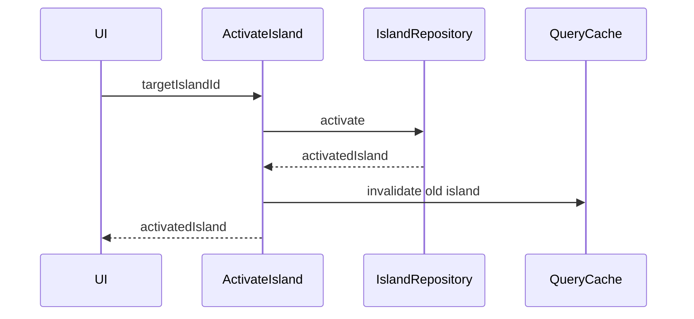

3. 상세 설계(SDS, Software Design Specification)

> **문서 상태:** Draft v0.2 · 최종 검토일 2026-08-24 · 기준 SRS v0.2 / SAD v0.1
> 

<aside>
🧩

**문서 목적**

개발자가 추가 해석 없이 구현을 시작할 수 있도록 화면, 도메인 객체, Use Case, Repository, API, DB, 상태 전이, 오류와 테스트 조건을 정의한다.

</aside>

**관련 문서:** 1. 요구사항 정의 및 분석(SRS, Software Requirements Specification) · 2. 아키텍처 설계(SAD, Software Architecture Design)

# 1. 설계 기준

## 1.1 적용 범위

- 웹: React + TypeScript + Vite, FastAPI, Supabase PostgreSQL
- 모바일: React Native + Expo, expo-sqlite
- 공통: TypeScript 도메인 모델, 검증 규칙, 계산 엔진 인터페이스, 디자인 토큰
- MVP 구현 제외: 날씨, 공략, 무 값 계산기, 아이템 변형별 수집, 일반 사용자 회원가입, 자동 동기화, NPC 자동 판별
- 날씨 기능은 MVP 이후 확장 기능으로 유지하며 현재 구현 범위와 완료 기준에서 제외한다.

## 1.2 설계 원칙

1. 모든 개인 기록은 islandId를 필수로 가진다.
2. 웹은 단일 사용자 구조로 운영하며 ownerId를 사용하지 않는다. 모든 개인 기록은 islandId로 구분한다.
3. 화면은 Repository가 HTTP인지 SQLite인지 알지 못한다.
4. MVP의 날짜·출현·루틴 계산은 UI와 저장소에서 분리한다. 무 값 계산은 Post-MVP에서 동일 원칙으로 추가한다.
5. 기준 게임 데이터와 사용자 기록을 분리한다.
6. 파괴적 작업은 영향 확인 후 실행한다.
7. 날씨 기능은 후속 버전에서 별도 설계·검증한 뒤 추가한다.

## 1.3 현재 설계 가정

- MVP 하단 내비게이션은 오늘·주민·도감 3개 탭으로 확정하고 공략 탭은 Post-MVP에서 추가한다.
- 내 섬 메뉴는 웹에서는 오른쪽 Drawer, 모바일에서는 Modal 또는 Drawer로 제공한다.
- 생물 및 아이템 상세는 웹에서는 모달, 모바일에서는 상세 화면으로 제공한다.
- 게임 날짜 경계는 오전 5시로 적용한다.
- 현재 시각은 기기 시각을 사용하고, 기준 날짜는 사용자가 수동으로 변경할 수 있다.
- 다가오는 이벤트 기본 범위는 7일이며 사용자 설정으로 변경 가능하게 한다.
- 섬 등록일은 입력·표시·저장하지 않는다.
- 주민은 현재·위시·캠핑장·과거 카테고리를 복수로 등록할 수 있다.
- 기준 게임 데이터는 확보된 Nookipedia API 데이터를 사용한다. 출처·버전·라이선스 표시 정책은 모바일 앱 설계 단계에서 확정한다.

# 2. 코드베이스 상세 구조

```
/
  apps/
    web/
      src/
        app/
        pages/
        features/
        shared/
    api/
      app/
        api/v1/
        application/
        domain/
        infrastructure/
        schemas/
        core/
      tests/
    mobile/
      app/
      src/
        features/
        infrastructure/
        shared/
  packages/
    domain/
      src/entities/
      src/value-objects/
      src/use-cases/
      src/engines/
      src/repositories/
      src/validation/
    game-data/
    ui-tokens/
    api-client/
```

## 2.1 명명 규칙

| 대상 | 규칙 | 예시 |
| --- | --- | --- |
| TypeScript 파일 | kebab-case | collection-repository.ts |
| React 컴포넌트 | PascalCase | RoutineChecklist |
| 함수·변수 | camelCase | getAvailableCreatures |
| Python 파일·함수 | snake_case | get_active_island |
| DB 테이블·컬럼 | snake_case 복수형 | collection_records |
| API JSON | camelCase | islandId |
| 오류 코드 | UPPER_SNAKE_CASE | ISLAND_NOT_FOUND |

# 3. 공통 도메인 모델

## 3.1 값 객체와 열거형

```tsx
type UUID = string;
type LocalDate = string;        // YYYY-MM-DD
type Hemisphere = "north" | "south";
type CreatureType = "insect" | "fish" | "sea_creature";
type VillagerCategory = "current" | "wish" | "campsite" | "past";
type VillagerCategories = VillagerCategory[];
type Period = "am" | "pm";
```

### 검증 규칙

- UUID: 표준 UUID 형식
- LocalDate: 실제 존재하는 날짜만 허용
- 섬 이름·주민대표 이름: trim 후 1자 이상, 최대 길이는 게임 기준 확인 전 40자
- weatherSeed: 0 이상의 안전한 정수, 실제 허용 범위는 날씨 엔진이 검증
- targetCount: 1 이상 999 이하
- 무 가격: 0 이상 999 이하 정수
- 생일: 유효한 월·일 조합
- 메모: 최대 500자

## 3.2 엔터티

### Island

```tsx
interface Island {
  id: UUID;
  name: string;
  hemisphere: Hemisphere;
  nativeFruit: string;
  nativeFlower: string;
  representative: Representative;
  isActive: boolean;
  createdAt: string;
  updatedAt: string;
}
```

**불변 조건**

- 한 저장 영역에서 활성 섬은 정확히 하나다.
- 섬 삭제 후 다른 섬이 있으면 가장 최근 사용 섬을 활성화한다.
- 마지막 섬 삭제 정책은 차단 또는 온보딩 복귀 중 제품 결정이 필요하다.

### RoutineDefinition / RoutineLog

```tsx
interface RoutineDefinition {
  id: UUID;
  islandId: UUID;
  name: string;
  targetCount: number;
  repeatRule: "daily" | "weekly" | "manual";
  sortOrder: number;
  isDefault: boolean;
  isActive: boolean;
}

interface RoutineLog {
  routineId: UUID;
  islandId: UUID;
  gameDate: LocalDate;
  currentCount: number;
  completed: boolean;
}
```

- completed는 currentCount가 targetCount 이상이면 true로 계산한다.
- 사용자가 완료 체크하면 currentCount를 targetCount로 변경한다.
- 완료 해제하면 currentCount를 0으로 변경한다.
- 루틴 정의 삭제 시 과거 로그는 보존하고 정의는 soft delete를 권장한다.

### CollectionRecord

```tsx
interface CollectionRecord {
  islandId: UUID;
  itemId: string;
  owned: boolean;
  caught: boolean;
  donated: boolean;
  firstRecordedDate?: LocalDate;
  updatedAt: string;
}
```

- 생물: caught와 donated 사용
- 화석·미술품: owned 또는 acquired와 donated 사용
- 카탈로그: owned 사용
- donated가 true이면 해당 카테고리에서 caught 또는 owned도 true로 정규화한다.

### VillagerHistory

```tsx
interface VillagerHistory {
  id: UUID;
  islandId: UUID;
  villagerId: string;
  categories: VillagerCategories;
  movedIn?: LocalDate;
  movedOut?: LocalDate;
  campsiteVisits: LocalDate[];
  photoOwned: boolean;
}
```

- 주민은 현재·위시·캠핑장·과거 카테고리에 복수 등록할 수 있으며 카테고리를 별도 관계로 저장한다.
- current 카테고리는 입주일을 가질 수 있다.
- past 카테고리는 movedOut을 선택 입력한다.
- 캠핑장 방문일은 여러 건 기록할 수 있다.
- photoOwned는 카테고리와 독립적으로 유지한다.

### WeatherSetting

```tsx
interface WeatherSetting {
  islandId: UUID;
  seed: number;
  hemisphere: Hemisphere;
  engineVersion: string;
  updatedAt: string;
}
```

- 날씨 설정은 Island 화면에서는 하나의 aggregate로 보이지만 저장소에서는 weather_settings로 분리한다.
- 섬당 날씨 설정은 최대 1개다.
- seed 또는 hemisphere 변경 시 기존 예보 캐시를 무효화한다.

# 4. Repository 계약

```tsx
interface IslandRepository {
  list(): Promise<Island[]>;
  get(id: UUID): Promise<Island>;
  create(input: CreateIslandInput): Promise<Island>;
  update(id: UUID, input: UpdateIslandInput): Promise<Island>;
  activate(id: UUID): Promise<Island>;
  delete(id: UUID, confirmation: string): Promise<void>;
}

interface RoutineRepository {
  listDefinitions(islandId: UUID): Promise<RoutineDefinition[]>;
  listLogs(islandId: UUID, date: LocalDate): Promise<RoutineLog[]>;
  upsertLog(input: RoutineLogInput): Promise<RoutineLog>;
}

interface CatalogRepository {
  search(query: CatalogQuery): Promise<Page<CatalogItem>>;
  getItem(itemId: string): Promise<CatalogItem>;
  listCollections(islandId: UUID, filter?: CollectionFilter): Promise<CollectionRecord[]>;
  upsertCollection(record: CollectionRecordInput): Promise<CollectionRecord>;
}

interface VillagerRepository {
  search(query: VillagerQuery): Promise<Page<Villager>>;
  getHistory(islandId: UUID, villagerId: string): Promise<VillagerHistory | null>;
  saveHistory(input: VillagerHistoryInput): Promise<VillagerHistory>;
}

interface NpcVisitRepository {
  list(islandId: UUID, from: LocalDate, to: LocalDate): Promise<NpcVisit[]>;
  create(input: CreateNpcVisitInput): Promise<NpcVisit>;
  update(id: UUID, input: UpdateNpcVisitInput): Promise<NpcVisit>;
  delete(id: UUID): Promise<void>;
}

interface WeatherRepository {
  getSetting(islandId: UUID): Promise<WeatherSetting | null>;
  saveSetting(input: WeatherSettingInput): Promise<WeatherSetting>;
  deleteSetting(islandId: UUID): Promise<void>;
}

interface TurnipRepository {
  getWeek(islandId: UUID, weekStart: LocalDate): Promise<TurnipWeek | null>;
  saveWeek(input: TurnipWeekInput): Promise<TurnipWeek>;
}
```

## 4.1 구현체

| 계약 | 웹 구현 | 모바일 구현 |
| --- | --- | --- |
| IslandRepository | HttpIslandRepository | SqliteIslandRepository |
| RoutineRepository | HttpRoutineRepository | SqliteRoutineRepository |
| CatalogRepository | HttpCatalogRepository | SqliteCatalogRepository |
| VillagerRepository | HttpVillagerRepository | SqliteVillagerRepository |
| NpcVisitRepository | HttpNpcVisitRepository | SqliteNpcVisitRepository |
| TurnipRepository | HttpTurnipRepository | SqliteTurnipRepository |

# 5. Application Use Case 상세

## UC-001 · 최초 온보딩

**입력:** 섬 정보, 주민대표 정보  

**사전조건:** 등록된 섬 없음

1. 입력값을 공통 스키마로 검증한다.
2. 섬과 주민대표 ID를 생성한다.
3. 섬을 활성 상태로 생성한다.
4. 기본 루틴 정의를 복제한다.
5. 저장을 하나의 트랜잭션으로 완료한다.
6. 오늘 화면으로 이동한다.

**실패 처리:** 어느 단계에서든 실패하면 전체 생성 취소  

**결과:** 활성 섬 1개와 기본 루틴 생성

## UC-002 · 활성 섬 변경

1. 대상 섬 존재 여부를 확인한다.
2. 대상 섬이 현재 저장소에 존재하는지 확인한다.
3. 현재 활성 섬을 비활성화한다.
4. 대상 섬을 활성화한다.
5. 트랜잭션을 커밋한다.
6. 화면 캐시 키에 포함된 islandId를 변경하고 이전 섬 쿼리를 무효화한다.



## UC-003 · 오늘 화면 조회

**입력:** islandId, selectedDate, 현재 시각

병렬 조회·계산 항목:

- 활성 섬 요약
- 해당 날짜 루틴과 로그
- 시즌·이벤트
- 현재 채집 가능 생물
- 최근 7일 NPC 방문
- 주민대표 및 현재 주민 생일
- 날씨 영역은 후속 버전에서 추가

**TodayViewModel**

```tsx
interface TodayViewModel {
  island: IslandSummary;
  date: LocalDate;
  events: EventSummary[];
  routines: RoutineItemView[];
  availableCreatures: CreatureCardView[];
  recentNpcVisits: NpcVisitView[];
}
```

각 영역 실패를 전체 화면 실패로 만들지 않는다. 섹션별 오류 상태를 제공한다.

## UC-004 · 루틴 체크

- 요청 키: islandId + routineId + gameDate
- currentCount를 목표 범위로 clamp한다.
- 중복 요청은 UPSERT한다.
- 웹은 낙관적 업데이트 후 실패 시 이전 상태로 rollback한다.
- 모바일은 SQLite 트랜잭션 완료 후 상태를 확정한다.

## UC-005 · 수집 상태 변경

1. 현재 활성 islandId를 명시적으로 전달한다.
2. itemId가 기준 데이터에 존재하는지 검증한다.
3. 카테고리별 허용 상태를 검증한다.
4. donated 정규화 규칙을 적용한다.
5. islandId + itemId로 UPSERT한다.
6. 목록·상세·완성률 캐시를 갱신한다.

## UC-006 · NPC 방문 기록

- NPC와 방문 날짜는 필수다.
- 한 날짜의 동일 NPC 중복 기록은 차단한다.
- 자동 추론은 하지 않는다.
- 최근 방문 목록은 selectedDate 기준 과거 6일을 포함한 7일 범위다.

## UC-007 · 날씨 시드 등록과 조회 — 후속 버전 설계 초안

### 등록

- seed와 hemisphere를 검증한다.
- 기존 설정을 덮어쓴다.
- 이전 forecast cache를 삭제한다.
- 검증용 날짜 1개에 대해 엔진 실행 가능 여부를 확인한다.

### 조회

1. WeatherSetting 조회
2. 시드가 없으면 seed_required 반환
3. WeatherEngine.forecast 실행
4. 지원 게임 버전과 engineVersion 포함
5. 불확실 데이터에는 warning 표시
6. 선택적으로 계산 결과 캐시

## UC-008 · MeteoNook JSON 가져오기 — 후속 버전 설계 초안

허용 최상위 필드: days, hemisphere

- 최대 파일 크기 기본 1MB
- JSON object만 허용
- 날짜 key와 y·m·d 일치 여부 확인
- dayType: 0~4
- showerType: 0~2
- types, stars, gaps는 배열
- 알 수 없는 필드는 무시하지 않고 warning 목록으로 반환
- 예보 데이터가 아닌 관측 기록임을 confirmation UI에 표시
- 미리보기 후 최종 저장

## UC-009 · 무 값 예측 — Post-MVP 설계 초안

**입력**

- 일요일 구입가
- 첫 구매 여부
- 지난주 패턴
- 월~토 오전·오후 판매가 12칸

**출력**

- 가능한 패턴 목록
- 패턴별 확률
- 시간대별 최소·최대 범위
- 입력 완성도
- 계산 엔진 버전

입력값 변경 시 debounce 후 재계산하며, 웹과 모바일 모두 같은 TurnipPredictor를 사용한다.

# 6. 화면 상세 설계

## 6.1 라우트

| 화면 | 웹 경로 | 모바일 경로 | 접근 조건 |
| --- | --- | --- | --- |
| 온보딩 | /onboarding | /(onboarding)/index | 섬 없음 |
| 오늘 | /today | /(tabs)/today | 활성 섬 있음 |
| 주민 | /villagers | /(tabs)/villagers | 활성 섬 있음 |
| 도감 | /catalog | /(tabs)/catalog | 활성 섬 있음 |
| 도감 상세 | /catalog/:itemId | /catalog/[itemId] | 항목 존재 |
| 공략 | /guides | /(tabs)/guides | 공통 |
| 무 값 | /guides/turnips | /guides/turnips | 활성 섬 있음 |
| 섬 설정 | Drawer | Modal 또는 Drawer | 활성 섬 있음 |

## 6.2 온보딩 화면

### 컴포넌트

- OnboardingPage
- IslandForm
- RepresentativeForm
- FruitPicker
- FlowerPicker
- DatePicker
- OnboardingProgress
- SubmitButton

### 상태

- form: 입력값
- step: island 또는 representative
- errors: 필드별 오류
- submitting
- submitError

### 동작

- 다음 버튼은 현재 단계 필수값이 유효할 때 활성화
- 뒤로 이동해도 입력값 유지
- 제출 중 중복 클릭 차단
- 성공 후 today로 replace navigation
- 브라우저 뒤로가기로 빈 온보딩에 돌아가지 않게 처리

## 6.3 오늘 화면

### 컴포넌트 트리

```
TodayPage
  AppHeader
    IslandSummaryButton
    DateNavigator
  SeasonEventSection
  RoutineChecklist
  AvailableCreatureSection
    CreatureTypeTabs
    CreatureCardList
  RecentNpcSection
  IslandDrawer
  BottomNavigation
```

### 상태 및 쿼리 키

- selectedDate: 화면 상태
- activeIslandId: 전역 상태
- creatureType: 화면 상태
- today query: ["today", islandId, selectedDate]
- collection query: ["collections", islandId]
- NPC query: ["npc-visits", islandId, from, to]

### 화면 상태

| 상태 | 표시 | 행동 |
| --- | --- | --- |
| loading | 카드별 skeleton | 입력 일부 유지 |
| empty routines | 루틴 추가 안내 | 추가 버튼 |
| seed required | 날씨 시드 등록 안내 | 섬 설정 열기 |
| section error | 해당 카드 오류 | 섹션 재시도 |
| offline mobile | 로컬 데이터 정상 표시 | 네트워크 경고 없음 |

## 6.4 내 섬 Drawer

- 현재 섬 여권 요약
- 현재 주민 미리보기
- 섬 선택 목록
- 섬 추가·수정·삭제
- Supabase Auth 소유자 로그인 화면과 인증 오류 안내
- 모바일 로컬 데이터 백업 안내
- 날씨 설정은 후속 버전에서 추가

섬 변경 중 Drawer를 즉시 닫고 새 섬 화면에 skeleton을 표시한다. 섬 삭제는 섬 이름을 확인 입력하게 할 수 있다.

## 6.5 도감 화면

- SearchBar
- CategoryTabs
- FilterSheet
- CompletionSummary
- CatalogGrid 또는 List
- CollectionToggle
- ItemDetail

검색 debounce 기본 250ms. 검색어와 필터는 URL query 또는 화면 상태로 유지한다. 섬 변경 시 검색 조건은 유지하고 수집 상태만 다시 조회한다.

## 6.6 주민 화면

- 이름 검색
- 현재·위시·캠핑장·과거 카테고리
- 종·성격·서브타입 필터
- 액자 보유 필터
- 주민 상세와 이력 편집

주민 기준 정보와 섬별 이력을 결합해 ViewModel을 만든다.

## 6.7 공략·무 값 화면 — Post-MVP 설계 초안

- BuyPriceInput
- FirstBuyToggle
- PreviousPatternSelect
- WeeklyPriceGrid
- PredictionChart
- PatternProbabilityList
- SaveWeekButton

알 수 없는 가격은 null로 저장한다. 오전·오후 입력 칸을 구분하고 과거 주 데이터와 섞지 않는다.

# 7. 웹 API 상세 계약

## 7.1 공통 헤더

```
Authorization: Bearer {supabase_access_token}
Content-Type: application/json
X-Request-ID: optional-client-uuid
```

## 7.2 응답 형식

성공 응답은 리소스 또는 data와 meta를 사용한다.

```json
{
  "data": {},
  "meta": {
    "traceId": "uuid"
  }
}
```

오류:

```json
{
  "error": {
    "code": "ISLAND_NOT_FOUND",
    "message": "섬을 찾을 수 없습니다.",
    "fieldErrors": {},
    "traceId": "uuid"
  }
}
```

## 7.3 섬 생성

**POST /api/v1/islands**

```json
{
  "name": "오리죠섬",
  "hemisphere": "north",
  "nativeFruit": "peach",
  "nativeFlower": "hyacinth",
  "representative": {
    "name": "오리죠",
    "birthdayMonth": 2,
    "birthdayDay": 11
  }
}
```

- 201 Created
- 같은 owner의 첫 섬이면 isActive true
- 기본 루틴 생성
- validation 실패 시 422

## 7.4 오늘 조회

**GET /api/v1/islands/{islandId}/today?date=2026-08-24**

- 섹션 집계 응답
- 날씨 계산 실패는 전체 500 대신 weatherStatus error와 warning 반환
- ETag 또는 Last-Modified는 기준 데이터 갱신 후 적용 가능

## 7.5 수집 상태 UPSERT

**PUT /api/v1/islands/{islandId}/collections/{itemId}**

```json
{
  "owned": false,
  "caught": true,
  "donated": true,
  "firstRecordedDate": "2026-08-24"
}
```

- 200 OK
- itemId 미존재 시 404
- 다른 사용자 섬이면 정보 노출 방지를 위해 404
- 카테고리상 허용하지 않는 상태는 422

## 7.6 삭제 계약

**DELETE /api/v1/islands/{islandId}?confirmation={islandName}**

- confirmation 불일치: 409 CONFIRMATION_MISMATCH
- 대상 없음 또는 소유권 없음: 404
- 성공: 204
- 마지막 섬 삭제 정책이 차단이면 409 LAST_ISLAND_DELETE_BLOCKED

# 8. FastAPI 상세 설계

## 8.1 의존성

- get_settings
- get_db_session
- get_access_guard
- get_island
- get_trace_id

```python
async def get_owned_island(
    island_id: UUID,
    session: AsyncSession = Depends(get_db_session),
    _: None = Depends(get_access_guard),
) -> Island:
    ...
```

## 8.2 계층별 책임

| 계층 | 허용 | 금지 |
| --- | --- | --- |
| Router | HTTP 파싱, status code, dependency | 직접 SQL, 핵심 규칙 |
| Schema | 요청·응답 타입과 필드 검증 | DB 접근 |
| Use Case | 업무 흐름, 권한, 트랜잭션 | HTTP 객체 의존 |
| Domain | 불변조건, 계산 정책 | FastAPI·SQLAlchemy 의존 |
| Repository | 쿼리와 영속화 | 화면 메시지 결정 |

## 8.3 트랜잭션 경계

- 온보딩 섬+대표+기본 루틴
- 활성 섬 변경
- 섬 삭제와 연결 기록 처리
- 무 주간 데이터와 12개 가격 저장
- MeteoNook import batch

# 9. DB 상세 설계

## 9.1 공통 컬럼

웹 변경 가능 테이블에는 id UUID, created_at timestamptz, updated_at timestamptz를 둔다. 모바일은 ISO datetime text로 저장할 수 있다.

- 현재 단일 사용자 웹 구조에서는 owner_id를 저장하지 않는다.
- routine_logs, collection_records, villager 관련 기록, npc_visits, turnip_weeks 등 하위 테이블은 island_id로 구분한다.
- 다중 사용자 기능을 추가할 때 islands.owner_id와 인증 구조를 migration으로 도입한다.
- weather_settings는 island_id를 PRIMARY KEY 또는 UNIQUE FK로 사용한다.
- island_villager_categories는 history_id + category를 복합 UNIQUE로 사용한다.
- campsite_visits는 주민 이력과 분리된 복수 방문 테이블로 저장한다.

## 9.2 외래키 삭제 정책

| 부모 | 자식 | 정책 |
| --- | --- | --- |
| islands | representatives | CASCADE |
| islands | routine_definitions·logs | CASCADE 또는 soft delete 백업 정책 확정 |
| islands | collection_records | CASCADE |
| catalog_items | collection_records | RESTRICT |
| villagers | island_villager_history | RESTRICT |
| turnip_weeks | turnip_prices | CASCADE |

## 9.3 주요 인덱스

```sql
CREATE UNIQUE INDEX uq_collection_island_item
ON collection_records (island_id, item_id);

CREATE UNIQUE INDEX uq_routine_log
ON routine_logs (island_id, routine_id, game_date);

CREATE INDEX ix_catalog_category_name
ON catalog_items (category, name_ko);

CREATE INDEX ix_villager_filter
ON villagers (species, personality, subtype);

CREATE INDEX ix_npc_visit_range
ON npc_visits (island_id, visit_date DESC);

CREATE UNIQUE INDEX uq_weather_setting_island
ON weather_settings (island_id);

CREATE UNIQUE INDEX uq_villager_history_category
ON island_villager_categories (history_id, category);
```

## 9.4 활성 섬 무결성

PostgreSQL과 SQLite 모두 활성화 트랜잭션 안에서 기존 활성 섬을 false로 바꾼 뒤 대상 섬을 true로 변경한다. 현재 단일 사용자 구조에서는 활성 섬이 전체 저장소에서 하나만 존재하도록 애플리케이션 트랜잭션과 테스트로 보장한다.

# 10. 모바일 SQLite 상세 설계

## 10.1 초기화 순서

1. DB open
2. foreign_keys ON
3. schema_version 확인
4. 순차 migration 실행
5. 기준 데이터 버전 확인
6. seed 데이터 적재 또는 갱신
7. 활성 섬 확인
8. 화면 시작

## 10.2 Migration 규칙

- 이미 배포된 migration 파일은 수정하지 않는다.
- migration은 멱등성을 갖도록 작성한다.
- 실행 전 transaction 시작
- 실패 시 rollback하고 기존 DB 보존
- 앱 코드가 지원하는 최소 schemaVersion을 확인한다.

## 10.3 쿼리 안전성

- 모든 값은 bind parameter 사용
- 동적 정렬 필드는 allowlist로 검증
- 대량 UPSERT는 transaction과 prepared statement 사용
- 화면 목록은 필요한 컬럼만 SELECT
- 완성률은 데이터 규모 확인 후 SQL 집계 또는 메모이제이션 선택

# 11. 상태 관리와 캐시

## 11.1 전역 UI 상태

- activeIslandId
- selectedDate
- islandDrawerOpen
- locale
- eventRangeDays
- creatureType

서버·DB 데이터 자체를 Zustand에 중복 저장하지 않는다.

## 11.2 웹 TanStack Query

| 데이터 | Query Key | 무효화 조건 |
| --- | --- | --- |
| 섬 목록 | islands | 추가·수정·삭제·활성화 |
| 오늘 | today,islandId,date | 루틴·NPC·날씨·섬 수정 |
| 도감 | catalog,query,filters | 기준 데이터 버전 변경 |
| 수집 | collections,islandId,filters | 수집 상태 변경 |
| 주민 이력 | island-villagers,islandId | 상태·액자·날짜 변경 |

## 11.3 모바일 반응성

- SQLite 변경 후 영향받은 Repository query를 다시 실행한다.
- 체크 UI는 로컬 optimistic state를 사용할 수 있으나 transaction 실패 시 원복한다.
- 기준 데이터는 메모리 전체 적재보다 SQL pagination을 우선한다.

# 12. 오류 코드

| 코드 | HTTP | 처리 |
| --- | --- | --- |
| AUTH_REQUIRED | 401 | 로그인 세션 만료 또는 유효하지 않은 관리자 계정 |
| TOKEN_INVALID | 401 | 세션 초기화 안내 |
| ISLAND_NOT_FOUND | 404 | 섬 목록으로 복귀 |
| VALIDATION_ERROR | 422 | 필드별 메시지 |
| CONFIRMATION_MISMATCH | 409 | 확인값 재입력 |
| DUPLICATE_RECORD | 409 | 기존 기록 표시 |
| WEATHER_SEED_REQUIRED | 422 | 설정 열기 |
| WEATHER_ENGINE_UNSUPPORTED | 422 | 정확도 경고 |
| IMPORT_SCHEMA_INVALID | 422 | 오류 위치 표시 |
| RATE_LIMITED | 429 | 대기 후 재시도 |
| INTERNAL_ERROR | 500 | traceId와 재시도 |

# 13. 보안 상세

- 프로덕션 웹과 FastAPI는 Supabase Auth의 사전 생성된 소유자 계정 1개로 보호한다.
- React에는 Supabase DB 비밀번호와 Service Role Key를 포함하지 않는다.
- 브라우저는 FastAPI를 통해서만 개인 데이터를 변경한다.
- 공개 회원가입을 비활성화하고, FastAPI는 Supabase JWT 검증 후 `sub === ADMIN_USER_ID`인 요청만 허용한다.
- 날씨 시드는 민감정보는 아니지만 로그에서 제외한다.
- JSON import는 MIME만 신뢰하지 않고 실제 파싱한다.
- SQL은 ORM 또는 bind parameter만 사용한다.
- Supabase Service Role Key는 서버 환경변수만 사용한다.
- 모바일 백업 파일에는 현재 민감정보가 없지만 향후 추가 시 암호화 여부를 재검토한다.

# 14. 성능 상세

| 항목 | 목표 | 방법 |
| --- | --- | --- |
| 오늘 화면 | 유효 콘텐츠 2초 이내 목표 | 병렬 조회, 섹션 렌더링, 캐시 |
| 루틴 체크 | 100ms 이내 피드백 | 낙관적 UI 또는 로컬 transaction |
| 도감 검색 | 입력 후 300ms 이내 목록 갱신 목표 | debounce, 인덱스, pagination |
| SQLite 시작 | 일반 기기 1초 내 DB 준비 목표 | 순차 migration, 지연 적재 |
| 날씨 계산 | 단일 날짜 200ms 이내 목표 | 순수 계산, 날짜 캐시 |
- 목록 기본 pageSize 30, 최대 100
- 오늘 API에서 불필요한 전체 기준 데이터를 반환하지 않는다.
- 이미지 lazy loading
- 모바일 대량 데이터는 FlatList 사용
- 계산 엔진 성능은 실제 구현 선택 후 다시 측정한다.

# 15. 테스트 상세

## 15.1 필수 단위 테스트

- Island: 활성 섬 단일성, 삭제 후 활성화
- Routine: count와 completed 정합성
- Collection: donated 정규화, 섬별 격리
- Availability: 월·시간·반구·경계 시각
- NPC: 동일 날짜 중복
- Weather: seed 범위, engine warning, JSON schema
- Turnip: null 가격, 경계 가격, 알려진 예측 결과

## 15.2 API 계약 테스트

- OpenAPI schema snapshot
- camelCase alias 직렬화
- 401·404·409·422 오류 형식
- 타 사용자 islandId 접근 차단
- 같은 UPSERT 반복 호출 결과 동일
- 삭제 transaction rollback

## 15.3 화면 수용 테스트

| ID | 시나리오 | 기대 결과 |
| --- | --- | --- |
| E2E-001 | 첫 접속 후 온보딩 완료 | 활성 섬과 기본 루틴이 표시됨 |
| E2E-002 | 두 번째 섬 생성 후 전환 | 수집·루틴 기록이 섞이지 않음 |
| E2E-003 | 과거 날짜로 이동 | 해당 날짜 루틴·이벤트·생물 표시 |
| E2E-004 | 도감 기증 체크 | 목록·상세·완성률 동시 갱신 |
| E2E-005 | 날씨 시드 없음 | 등록 안내와 설정 이동 |
| E2E-006 | NPC 수동 등록 | 최근 7일 목록에 표시 |
| E2E-007 | 모바일 비행기 모드 | 모든 핵심 기록 기능 정상 |
| E2E-008 | 잘못된 MeteoNook JSON | 저장 없이 오류 위치 안내 |

# 16. 구현 완료 정의

- [ ]  공용 도메인 API와 Repository 계약 구현
- [ ]  웹과 모바일에서 동일한 도메인 테스트 통과
- [ ]  모든 개인 기록 쿼리에 islandId 적용
- [ ]  Supabase Auth 단일 소유자 로그인, JWT 검증 및 회원가입 차단 적용
- [ ]  PostgreSQL·SQLite migration 작성
- [ ]  OpenAPI 문서와 실제 응답 일치
- [ ]  주요 화면 loading·empty·error·offline 상태 구현
- [ ]  SRS Must 요구사항 E2E 연결
- [ ]  MVP에 사용하는 Nookipedia 데이터 출처 정보 관리
- [ ]  성능 목표 측정 결과 기록
- [ ]  웹 Preview와 모바일 실기기 검증

# 17. 확정 사항 및 후속 결정

## 17.1 확정

- [x]  섬·주민대표 이름은 최대 10자로 제한
- [x]  마지막 섬은 삭제할 수 없음
- [x]  게임 날짜 경계는 오전 5시
- [x]  주민은 하단 내비게이션의 독립 탭으로 제공
- [x]  주민 카테고리는 현재·위시·캠핑장·과거를 복수 등록 가능
- [x]  생물 및 아이템 상세는 웹 모달, 모바일 독립 상세 화면
- [x]  현재 시각은 기기 시각을 사용하고 날짜는 수동 변경 가능
- [x]  섬 등록일 필드 제거
- [x]  웹은 1인 전용이며 사용자 데이터는 Supabase PostgreSQL에 저장
- [x]  기준 데이터는 확보된 Nookipedia API 데이터를 사용
- [x]  날씨 기능은 MVP에서 제외하고 후속 버전으로 이동

## 17.2 모바일 개발 시 결정

- [ ]  모바일 개발 시 Nookipedia 데이터 출처·버전·라이선스 표시 방식 결정
- [ ]  모바일 로컬 데이터 백업·복원 기능 포함 시점
- [ ]  최소 지원 iOS·Android 버전

## 17.3 웹 배포 전 결정

- [x]  1인 전용 웹앱은 Supabase Auth 기반 단일 소유자 로그인 사용
- [x]  MVP 지원 브라우저는 최신 Chrome·Edge·Safari 최근 2개 주요 버전

# 18. 변경 이력

| 버전 | 일자 | 변경 내용 |
| --- | --- | --- |
| v0.2 | 2026-08-24 | ownerId 정규화, 주민 복수 카테고리, WeatherSetting과 Repository 계약 보완 |
| v0.1 | 2026-08-24 | SRS v0.2와 SAD v0.1 기반 공통 도메인, Use Case, 화면, API, FastAPI, DB, SQLite, 오류·보안·테스트 상세설계 작성 |